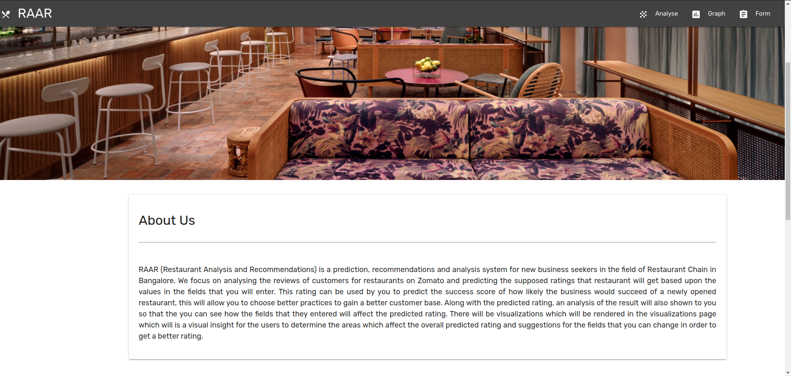
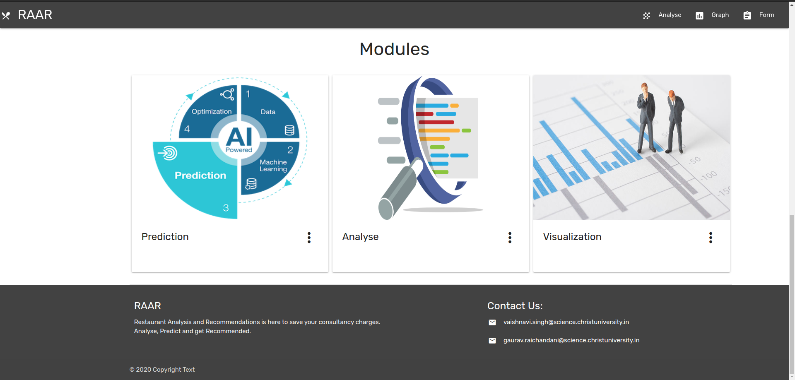
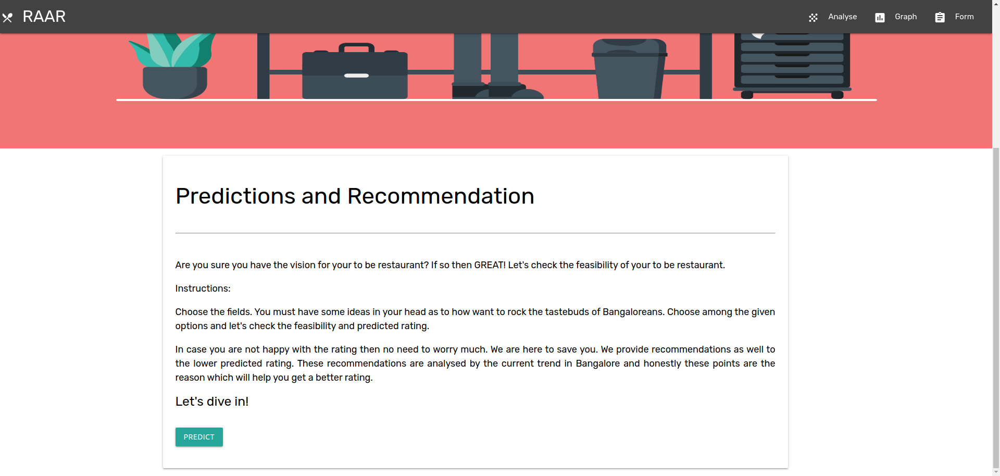
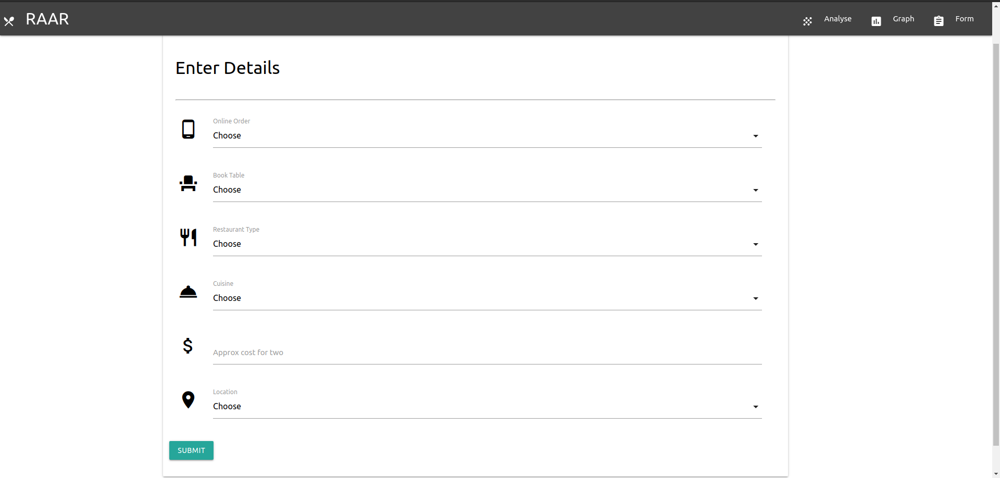

# RAAR
*Restaurant Analysis and Recommendation*  
This project focuses on analysing the reviews of customers for restaurants on Zomato and perform analysis to finally show the key points that are crucial in deciding if a restaurant is doing well or not. Furthermore this previously analysed datail are used to predict the feasibility of a newly opened restaurant, that allows them to choose for better practices to gain better customer base.  
# Configure Flask
```
git clone "link"  
cd ZAAR  
python3 -m venv venv  
source venv/bin/activate  
pip flask install
```
# Running script
```
export FLASK_APP=script.py  # for linux  
set FLASK_APP=script.py     # for windows  
flask run  
```
# Deactivating virtual environment
```
deactivate 
```

# Screenshots
  
  
  
  
